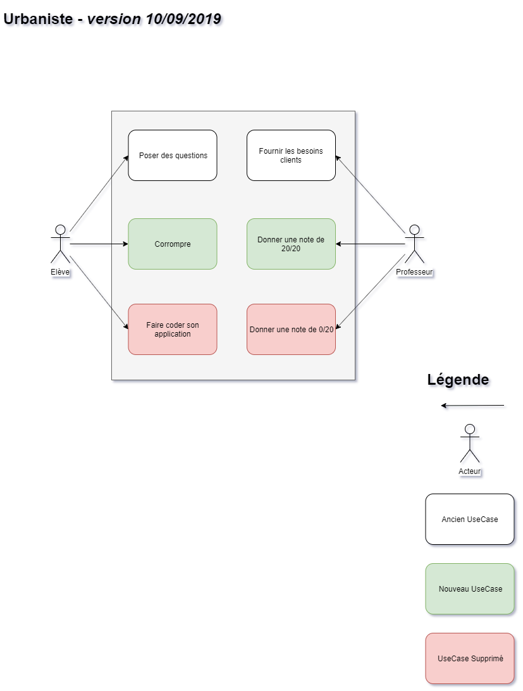

[Sommaire](https://ursi-2020.github.io/Documentation/)

[API](api.md)

# Rôle de l'application

Le rôle de l'application est de ...

Pour ce faire, elle ... communique avec ...

# Use Case

# Membre du groupe

* Léo Menschenfreund
* Mikaël Simarik
