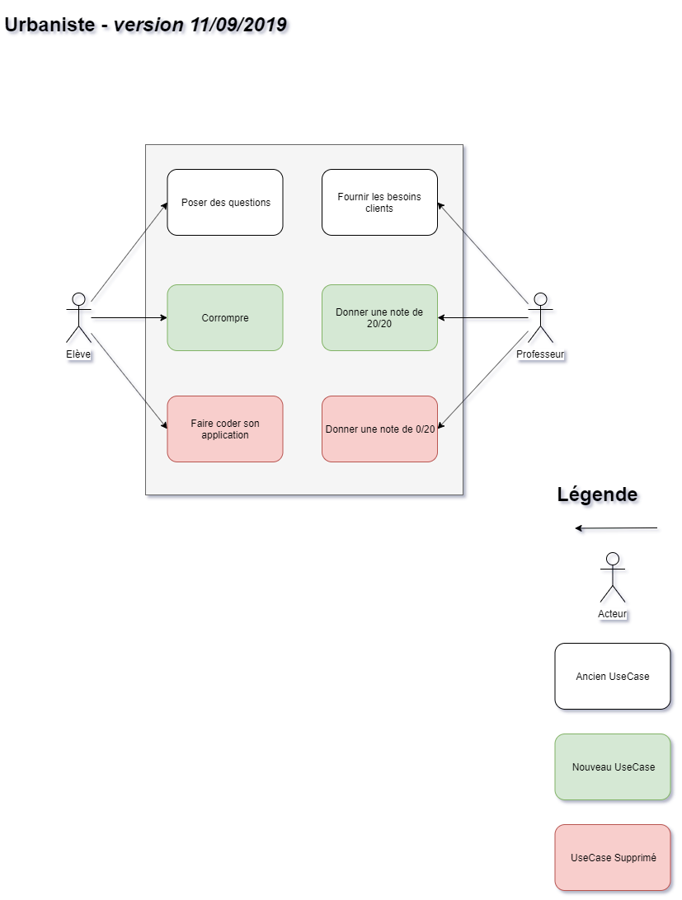

[Sommaire](https://ursi-2020.github.io/Documentation/)

Voici un exemple de documentation pour une application.

*[API](api.md)*
*[Anciennes versions des Uses Cases](use-case.md)*

# Rôle de l'application

Le rôle des urbanistes est de s'assurer que les applications répondent aux spécifications fonctionnelles fournies par les professeurs.

Pour ce faire, ils s'assurent de la cohérence de l'architecture du système d'information et de coordonnent les différentes équipes de la classe.

# Use Case

# Membre du groupe

* Léo Menschenfreund
* Mikaël Simarik
