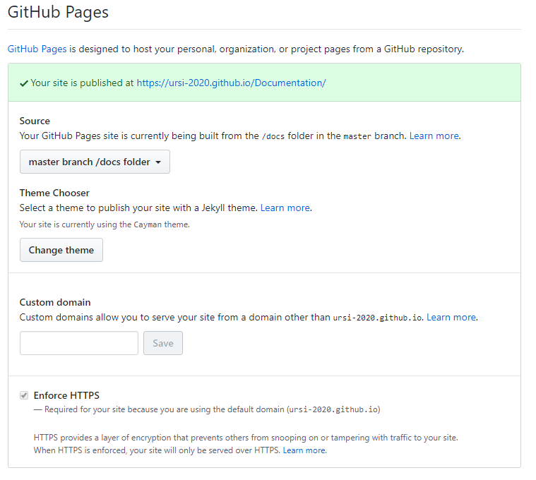

[Sommaire](https://ursi-2020.github.io/Documentation/)

# Création de la documentation

GitHub Pages est l'outil permettant de documenter le projet *End Game*.

# Etapes pour créer une Github Page

1. Dans le repository, créer un dossier docs et intégrer tous les fichiers dans ce dossier: [https://github.com/ursi-2020/Documentation/tree/master/docs/archi-doc](https://github.com/ursi-2020/Documentation/tree/master/docs/archi-doc)
2. Activer *GitHub Pages* dans les settings du repository (settings/options/GitHub Pages)
3. Changer le thème et sélectionner *Cayman*
4. Définir la source comme étant *master branch /docs folder*
5. La root de votre documentation est le fichier `index.md`

*Configuration finale*
