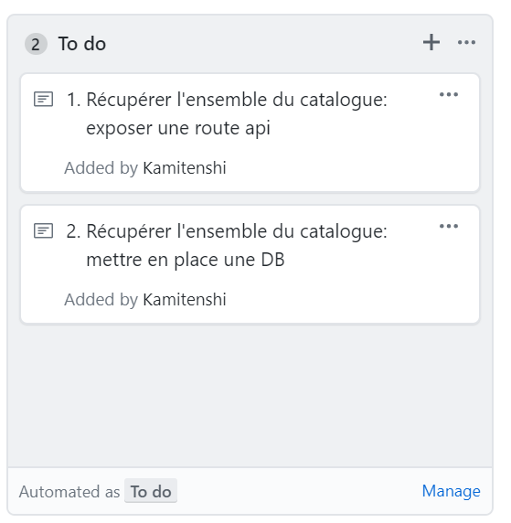

# Rédaction de la documentation

## Etapes

1. Récupérer la dernière version des use cases: [lien](https://www.draw.io/?state=%7B%22ids%22:%5B%221lC5PK-BYC3nax0gop3B3FXLZdtuGB7vb%22%5D,%22action%22:%22open%22,%22userId%22:%22106243896075731504274%22%7D#G1lC5PK-BYC3nax0gop3B3FXLZdtuGB7vb)
2. Ajouter une nouvelle section dans votre draw.io correspondant à la dernière version: [lien](https://drive.google.com/drive/folders/1acpu97eWynQshQFGJpbcqWEgHbRwEIEr)
3. Validation par les urbanistes
4. Création des story technique dans l'onglet `projects` sur votre repo github
5. Mise à jour des données de référence et transactionnelles 

## Exemple

* Application: Catalogue
* Use cases fonctionnels: Récupérer l'ensemble du catalogue
* Story technique:

